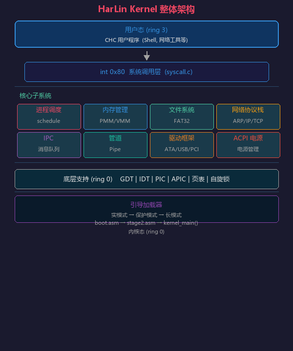
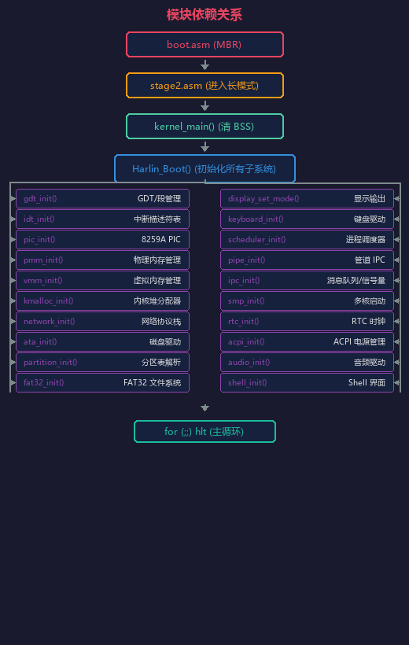
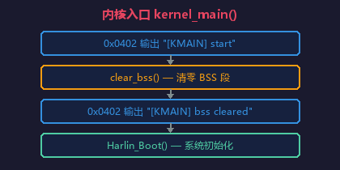
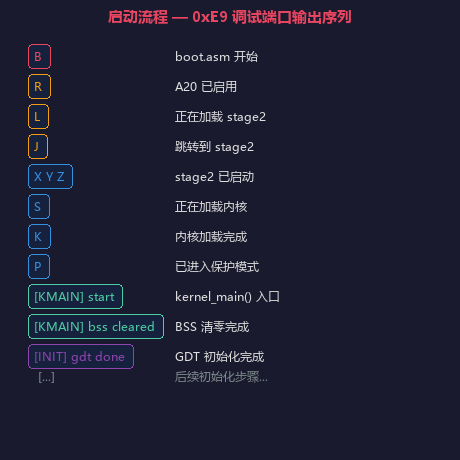
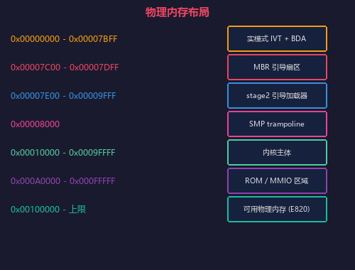
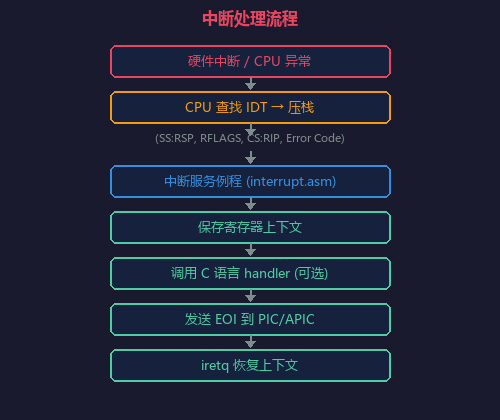
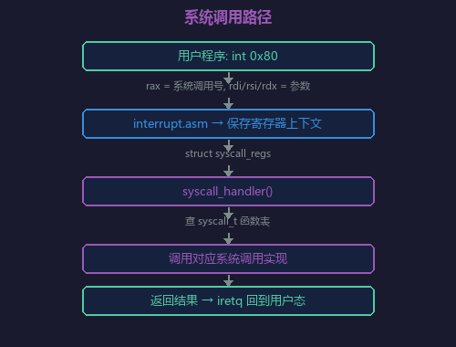
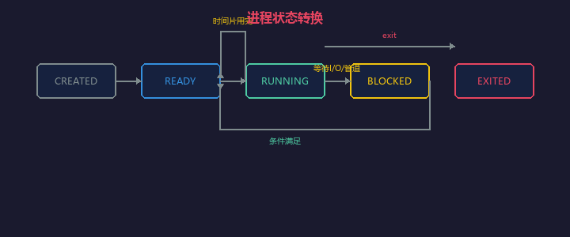
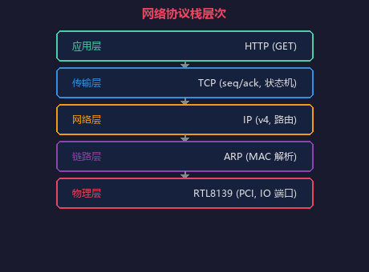

# HarLin Kernel 架构说明

本文档介绍 HarLin Kernel 的整体架构设计、模块组织、内存布局和核心机制。

***

## 一、整体架构

HarLin Kernel 是一个运行于 x86_64 架构的 64 位操作系统内核，采用**宏内核**设计。所有核心服务——进程调度、内存管理、文件系统、网络协议栈、设备驱动——均运行在 ring 0 内核态，用户程序运行在 ring 3 用户态。

### 1.1 分层结构



### 1.2 模块依赖关系



---

## 二、启动流程

### 阶段 1: BIOS 引导 (boot.asm)

- 入口：`0x7C00` (MBR)
- 初始化段寄存器和栈
- 通过 INT 0x13 读取 stage2 到 `0x8000`
- 启用 A20 地址线
- 跳转到 `0x7E00` (stage2 入口)

### 阶段 2: 扩展引导 (stage2.asm)

- 设置实模式段寄存器和栈
- 将内核从加载地址复制到 `0x10000` (`ES:DI = 0x1000:0x0000`)
- 加载 GDT (全局描述符表)
- 设置 CR0.PE 位，切换到**保护模式** (32 位)
- 初始化页目录：identity map 前 512MB 物理内存 (2MB 大页)
- 设置 CR3 → CR4.PAE → EFER.LME，切换到**长模式** (64 位)
- 跳转到 64 位入口，调用 `kernel_main()`

### 阶段 3: 内核入口 (kernel.c)



### 阶段 4: 系统初始化 (harlin_API.c)

`Harlin_Boot()` 按严格顺序初始化所有子系统，每一步均通过 `0x0402` 调试端口输出进度。初始化完成后进入空闲主循环：

```c
interrupts_enable();
for (;;) {
    asm volatile ("hlt");
}
```

### 调试端口输出序列



---

## 三、内存布局

### 3.1 物理内存布局



| 范围 | 用途 |
|------|------|
| `0x00000000 - 0x00007BFF` | 实模式 IVT + BDA |
| `0x00007C00 - 0x00007DFF` | MBR 引导扇区 (boot.asm) |
| `0x00007E00 - 0x00009FFF` | stage2 引导加载器 |
| `0x00008000` | SMP 多核启动 trampoline |
| `0x00010000 - 0x0009FFFF` | 内核主体 |
| `0x000A0000 - 0x000FFFFF` | ROM/MMIO 区域 |
| `0x00100000 - 上限` | 可用物理内存 (由 E820 探测) |

物理内存管理基于**位图 (bitmap)**，位图位于 `PMM_BITMAP_ADDR`，管理 `PMM_TOTAL_PAGES` 个 4KB 页面，覆盖 `PMM_BASE_ADDR` 起始的物理内存区域。

### 3.2 虚拟内存布局 (x86-64 四级页表)

| 虚拟地址范围 | 用途 |
|-------------|------|
| `0x0000000000400000 - 0x00000000007FFFFF` | 用户程序地址空间 |
| `0xFFFF800000000000` | 内核堆起始地址 (kmalloc) |
| `0x0000800000000000` | VMM 临时映射窗口 |
| `KERNEL_PML4_VIRT` | 内核 PML4 自引用 |

### 3.3 内核堆分配器

基于 slab/链表的堆分配器，管理 `KERNEL_HEAP_START` 起始的虚拟地址空间：
- 最小分配粒度：16 字节
- 通过 `pmm_alloc()` + `vmm_map()` 惰性扩展堆空间
- 线程安全（自旋锁保护）

---

## 四、中断处理架构

### 4.1 IDT (中断描述符表)

- 256 个条目，覆盖 0-255 号中断向量
- 0-31：CPU 异常（#DE, #GP, #PF 等）
- 32-47：硬件 IRQ (8259A PIC → 重映射到 0x20-0x2F)
- 0x80：系统调用入口

### 4.2 中断处理流程



### 4.3 时钟中断

- IRQ0 (PIT 通道 0) 触发调度器 `timer_handler()`
- 每次时钟中断检查当前进程时间片，到期则触发进程切换

---

## 五、系统调用

入口：`int 0x80`，通过 `syscall.c` 分发。

### 系统调用编号 (部分)

| 编号 | 名称 | 功能 |
|------|------|------|
| 0 | exit | 退出进程 |
| 1 | write | 写入数据 |
| 2 | read | 读取数据 |
| 3 | open | 打开文件 |
| 4 | close | 关闭文件 |
| 5 | exec | 执行用户程序 |

### 调用路径



---

## 六、进程与 IPC

### 6.1 进程调度

- 最多 16 个进程 (`MAX_PROCESSES`)
- 基于**优先级 + 时间片轮转**
- 默认时间片：10 个时钟滴答
- 每个 CPU 维护当前进程 ID (`current_process_percpu`)
- 上下文保存：所有通用寄存器、RFLAGS、RSP

### 6.2 进程状态



### 6.3 管道 IPC

- 内核管道对象，16 个可用管道
- 缓冲区大小：4096 字节
- 支持读/写等待队列（进程阻塞与唤醒）
- 自旋锁保护并发访问

### 6.4 消息队列与信号量

- 消息队列：最多 `IPC_MAX_QUEUES` 个，支持 `send`/`recv` 操作
- 信号量：最多 `IPC_MAX_SEMS` 个，支持 `wait`/`post`

---

## 七、文件系统

### 7.1 磁盘 I/O

- ATA PIO 模式驱动 (`ata.c`)
- 支持 LBA48 寻址 (64 位 LBA)
- 读写扇区接口：`ata_read_sectors()` / `ata_write_sectors()`

### 7.2 分区表

- 解析 MBR 分区表 (`partition.c`)
- 最多 4 个主分区
- 提供 `partition_get()` 接口获取分区信息

### 7.3 FAT32 文件系统

- 完整 FAT32 读写支持
- 长文件名 (LFN) 解析
- 目录遍历、文件创建/删除
- 当前目录管理 (`cwd_path`)

---

## 八、网络协议栈

### 8.1 驱动层

- RTL8139 PCI 网卡驱动（IO 端口方式）
- 接收缓冲区：`RX_BUF_SIZE = 0x2000`
- 4 个发送描述符，每个 2048 字节

### 8.2 协议层



### 8.3 主要协议

| 协议 | 功能 | 状态 |
|------|------|------|
| ARP | MAC 地址解析 | 支持请求/应答 |
| IP | IPv4 收发 | 支持 |
| DHCP | 动态获取 IP | 支持 (10.0.2.0/24 子网) |
| TCP | 可靠传输 | 支持 (最多 4 个连接) |
| DNS | 域名解析 | 支持 |
| HTTP | Web 请求 | 支持 GET 方法 |

---

## 九、SMP 多核

### 9.1 启动流程 (BSP → AP)

1. BSP 初始化 LAPIC 基地址
2. 安装 trampoline 代码到 `0x8000`
3. 构造 AP 启动参数（PML4、栈、入口、CPU ID）
4. 发送 INIT IPI → 等待 10ms
5. 发送 SIPI → 等待 200µs
6. 重复 SIPI 一次
7. AP 启动后执行 trampoline 进入保护模式/长模式
8. AP 完成初始化后自增 `ap_started_count`

### 9.2 每个 CPU 数据结构

- `percpu` 区域：每个 CPU 独立的变量（当前进程 ID、TSS 等）
- 基于 FS 段基址 (`MSR_FS_BASE`) 访问

---

## 十、电源管理 (ACPI)

### 10.1 初始化流程

1. 扫描 EBDA 和 BIOS 内存区域查找 RSDP ("RSD PTR ")
2. 验证 RSDP 校验和
3. 通过 RSDT 定位 FADT 表
4. 从 FADT 获取 PM1a 控制寄存器地址
5. 解析 `SLP_TYPa` 和 `SLP_TYPb`（S5 睡眠状态）

### 10.2 关机操作

```c
Harlin_Shutdown():
    pm1a_cnt = inw(pm1a_cnt_blk)
    pm1a_cnt |= SLP_TYPa | SLP_EN
    outw(pm1a_cnt_blk, pm1a_cnt)
```

---

## 十一、显示输出

### 11.1 VGA 文本模式 (0x03h)

- 默认模式：80x25 字符，16 色
- 显存地址：`0xB8000`
- 通过 `screen.c` 提供字符输出

### 11.2 VESA 图形模式

- 通过 INT 0x10 VBE 切换高分辨率模式
- 线性帧缓冲映射到虚拟地址空间
- 支持像素绘制、字符串绘制、清屏操作

---

## 十二、驱动框架

当前支持的设备驱动：

| 类别 | 设备 | 源码路径 |
|------|------|----------|
| 磁盘 | ATA (PIO) | `src/harlin/drv/ata.c` |
| 输入 | PS/2 键盘 | `src/harlin/drv/keyboard.c` |
| 输入 | PS/2 鼠标 | `src/harlin/drv/mouse.c` |
| 网络 | RTL8139 | `src/harlin/net/network.c` |
| 音频 | PC Speaker | `src/asm/audio/speaker.asm` |
| 音频 | Sound Blaster 16 | `src/harlin/drv/sb16.c` |
| 音频 | WAV 播放 | `src/harlin/drv/wav.c` |
| 时钟 | PIT, RTC | `src/harlin/drv/rtc.c` |
| 总线 | PCI | `src/harlin/drv/pci.c` |
| 总线 | USB (基础) | `src/harlin/drv/usb.c` |

---

## 十三、Shell

用户界面基于图形模式实现：
- 窗口标题栏 + 输出区域 + 输入框
- 支持命令历史（通过键盘缓冲区）
- 自定义命令集（文件操作、网络工具、系统信息等）
- 运行于 ring 3 用户态

---

## 十四、构建系统

### 14.1 构建流程

```
nasm → boot.bin (512B MBR)
nasm → stage2.bin (扩展引导)
nasm → *.o (汇编模块)
clang → *.o (C 模块)
ld.lld → kernel.bin (链接)
拼接 → boot.img (引导镜像)
mkisofs → HarLin.iso (CD-ROM 镜像)
dd + fat32 → HarLin.img (软盘/硬盘镜像)
```

### 14.2 构建产物

| 文件 | 路径 | 说明 |
|------|------|------|
| `boot.bin` | `build/Binary/` | 512 字节引导扇区 |
| `stage2.bin` | `build/Binary/` | 扩展引导加载器 (~8KB) |
| `kernel.bin` | `build/Binary/` | 内核二进制 |
| `HarLin.iso` | `build/` | CD-ROM 启动镜像 |
| `HarLin.img` | `build/` | 软盘/硬盘镜像 |

---

## 十五、源码目录结构

```
src/
├── asm/                    # 汇编源码
│   ├── audio/              #   蜂鸣器驱动 (speaker.asm)
│   ├── boot/               #   引导加载器 (boot.asm, stage2.asm, a20.asm)
│   ├── gdt/                #   GDT 表操作 (gdt.asm, gdt_flush.asm)
│   ├── intr/               #   中断处理 (interrupt.asm, pic.asm)
│   ├── smp/                #   多核 trampoline
│   ├── sync/               #   原子操作 (atomic.asm)
│   └── util/               #   工具 (print.asm, delay.asm)
├── harlin/                 # C 语言内核模块
│   ├── acpi/               #   ACPI 电源管理
│   ├── core/               #   内核核心 (GDT, IDT, SMP, 自旋锁, percpu, kernel_main)
│   ├── drv/                #   设备驱动 (ATA, 键盘, 鼠标, PCI, RTC, USB, 音频)
│   ├── fs/                 #   文件系统 (FAT32, 分区表)
│   ├── gpu/                #   显示输出 (VGA 文本, VESA 图形)
│   ├── mem/                #   内存管理 (PMM, VMM, kmalloc, E820, initramfs)
│   ├── net/                #   网络协议栈 (RTL8139 + ARP/IP/TCP/DHCP/DNS/HTTP)
│   ├── proc/               #   进程管理 (调度器, 管道, IPC)
│   ├── shell/              #   Shell 界面
│   └── syscall/            #   系统调用层 (harlin_API, syscall 分发)
├── head/                   # C 头文件
│   ├── acpi/               #   ACPI 头文件
│   ├── core/               #   核心头文件 (gdt.h, interrupt.h, spinlock.h, smp.h 等)
│   ├── drv/                #   驱动头文件 (ata.h, keyboard.h, pci.h, rtc.h, usb.h 等)
│   ├── fs/                 #   文件系统头文件 (fat32.h, partition.h)
│   ├── gpu/                #   显示头文件 (display.h, screen.h)
│   ├── mem/                #   内存头文件 (pmm.h, vmm.h, kmalloc.h, e820.h 等)
│   ├── net/                #   网络头文件 (network.h)
│   ├── proc/               #   进程头文件 (scheduler.h, ipc.h, pipe.h)
│   └── syscall/            #   系统调用头文件 (harlin_API.h)
└── harlin/
    └── linker.ld           # 链接脚本
```
